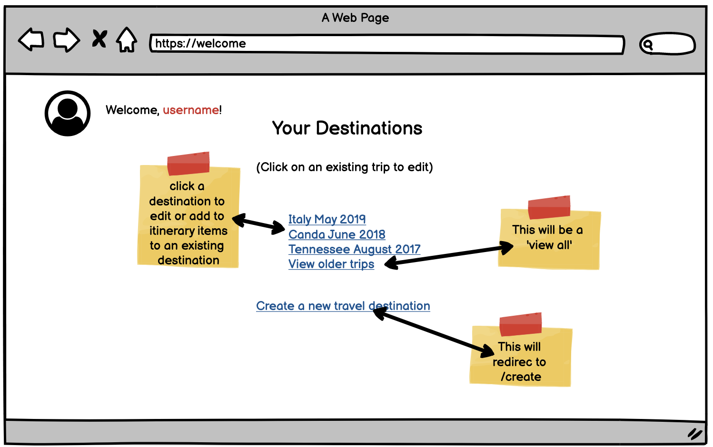
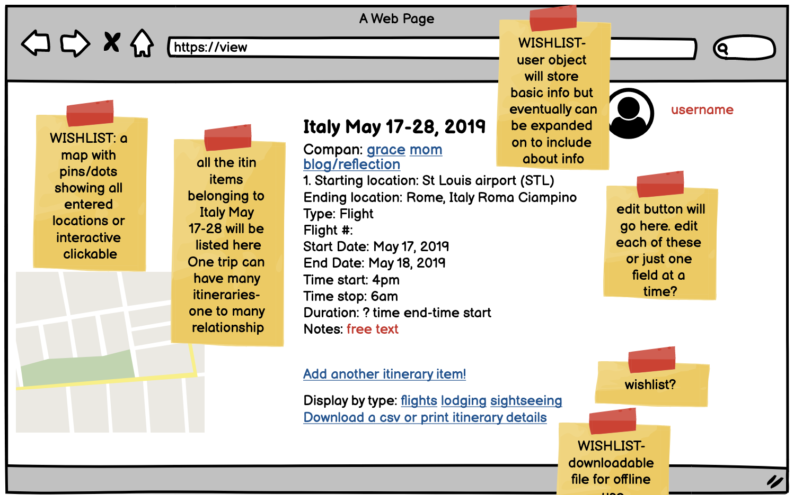
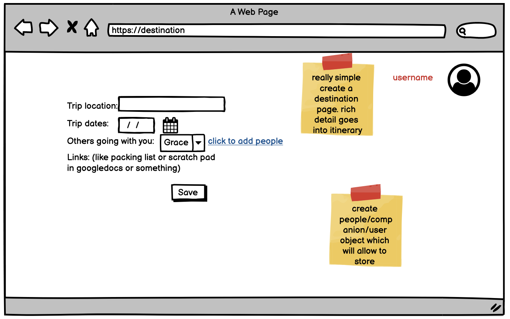
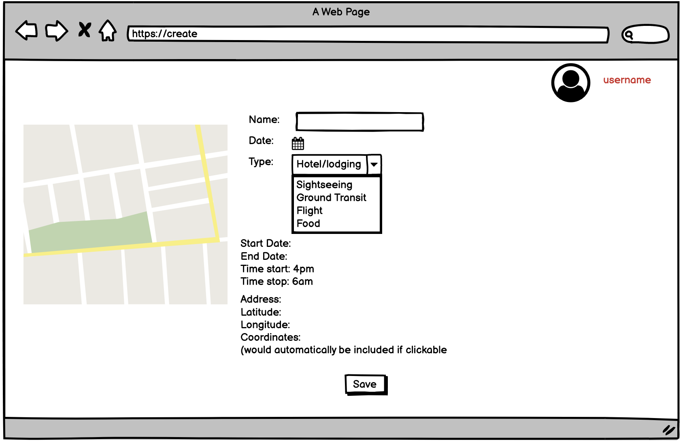

<h1>Project Planning</h1>

Assignment 2

<h2>Wireframes</h2>
  
  - Home Page
  
  
  - Welcome User
  

  - View Destinations
  
  
  - Create New Destination
  
  
  - Create New Itinerary Item
  

<h2>Project tracker</h2>
  <a href="https://trello.com/b/js2SzEQG/travel-planner-lo-2020">Travel Planner Trello Board</a>

<h2>Project Repo Link</h2>
<a href="https://github.com/bmconstant16/DestinationMVP_LO">GitHub Repo</a>
