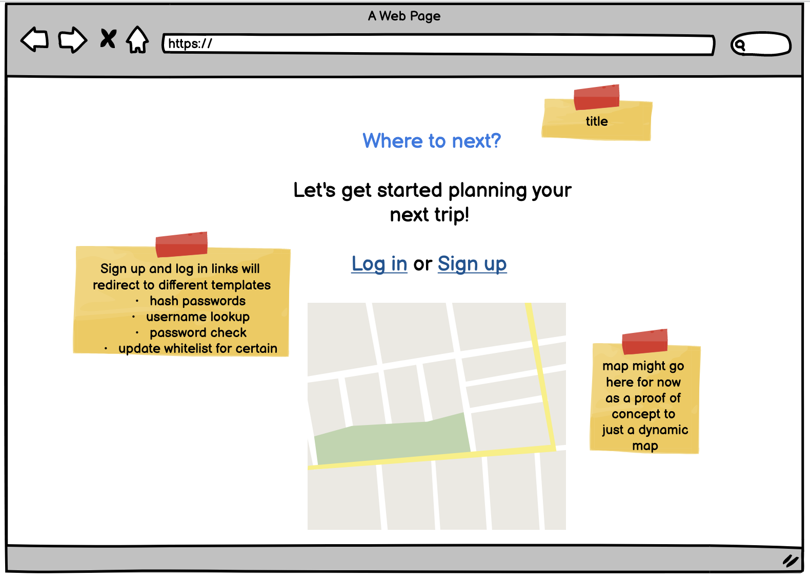

<h1>Project Planning</h1>

Assignment 2

<h2>Wireframes</h2>
  <ul>
    
    <li></li>
    <li>
This is the user welcome screen
</li>
    <li> 
This is the view destinations page
</li>
    <li>
This is the create new detination page
</li>
    <li>
This is the create new itinerary page
</li>
    
  </ul>  
  

<h2>Project tracker</h2>
  <a href="https://trello.com/b/js2SzEQG/travel-planner-lo-2020">Travel Planner Trello Board</a>

<h2>Project Repo Link</h2>
<a href="https://github.com/bmconstant16/DestinationMVP_LO">GitHub Repo</a>
